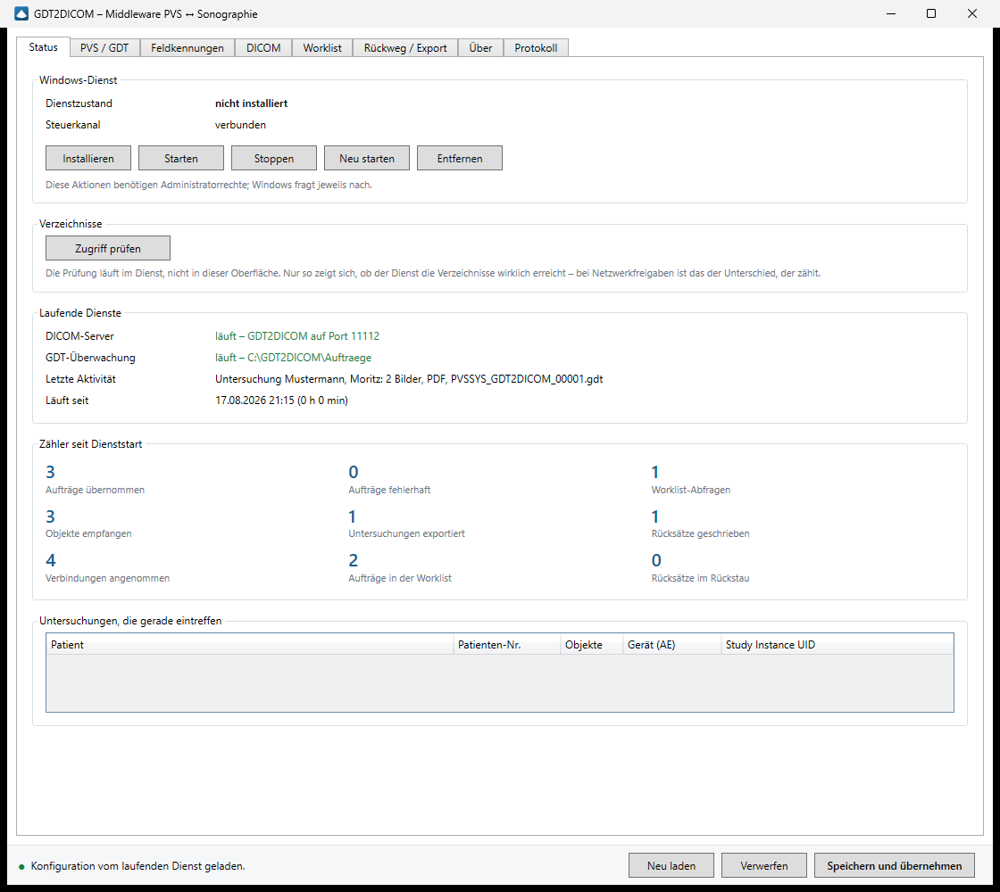
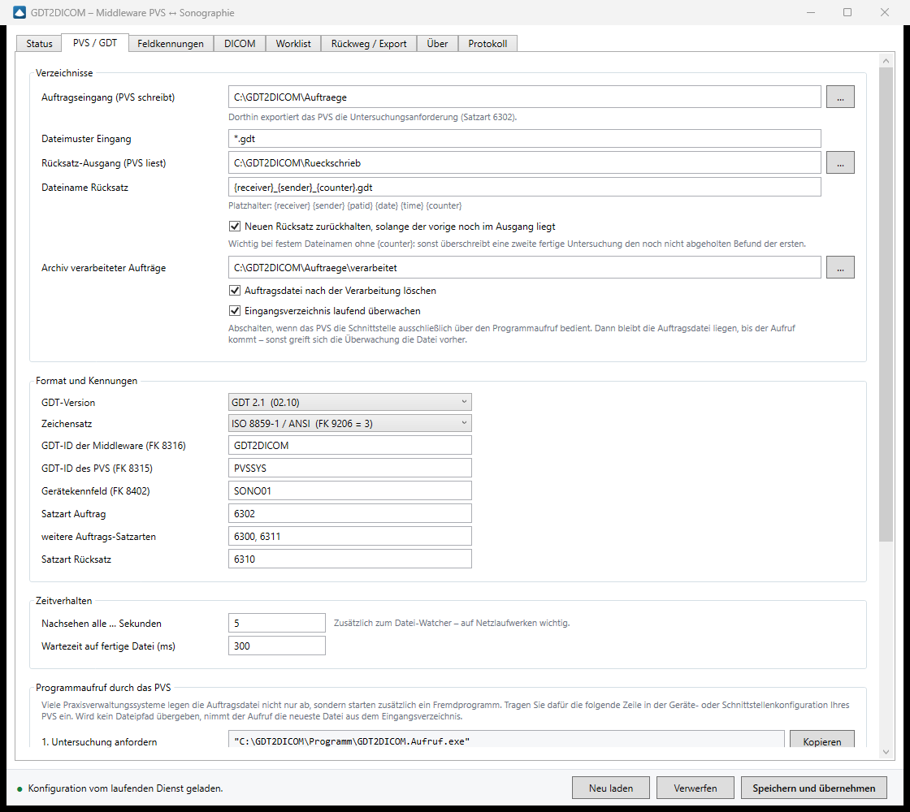
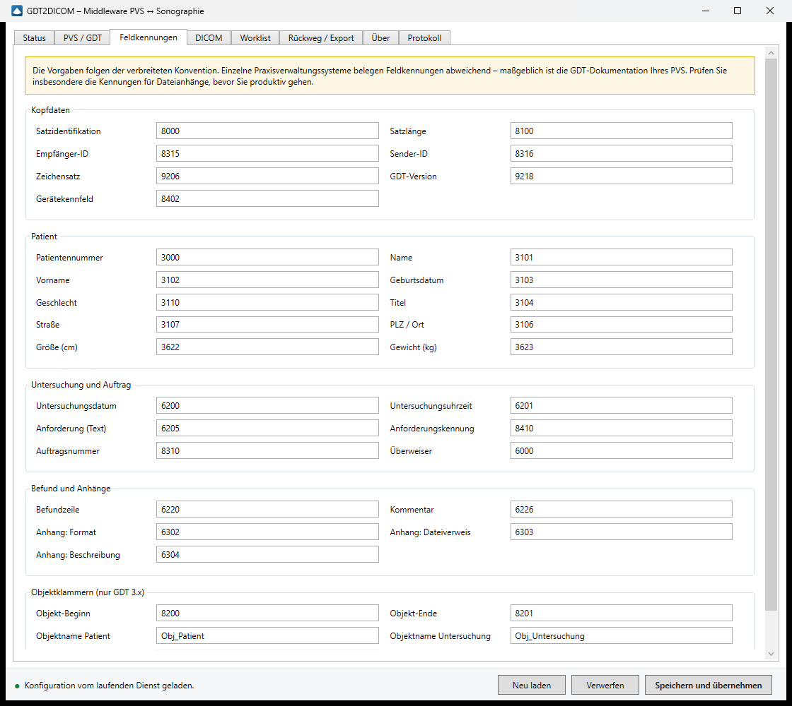
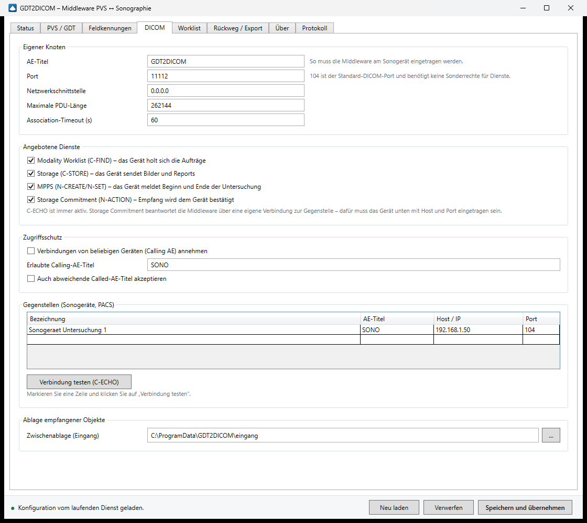
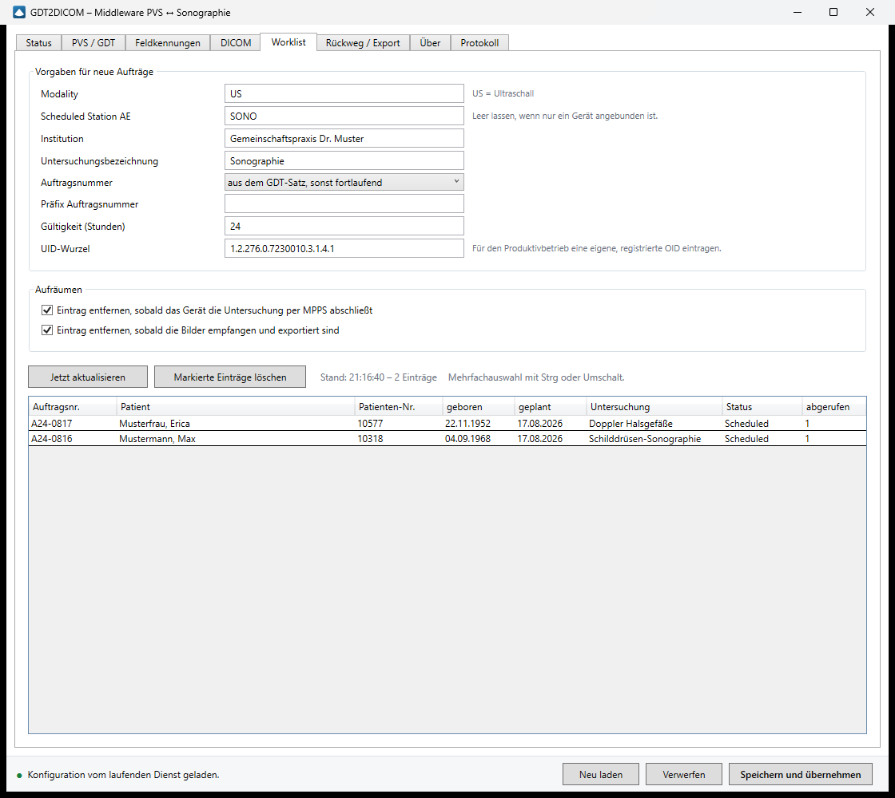
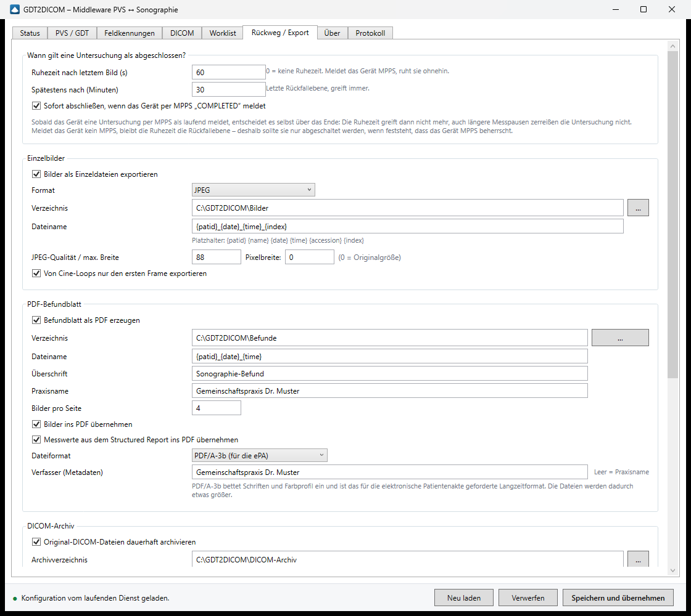
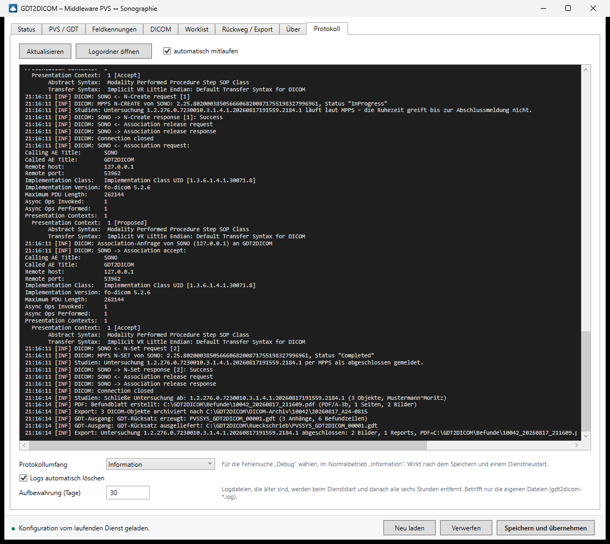
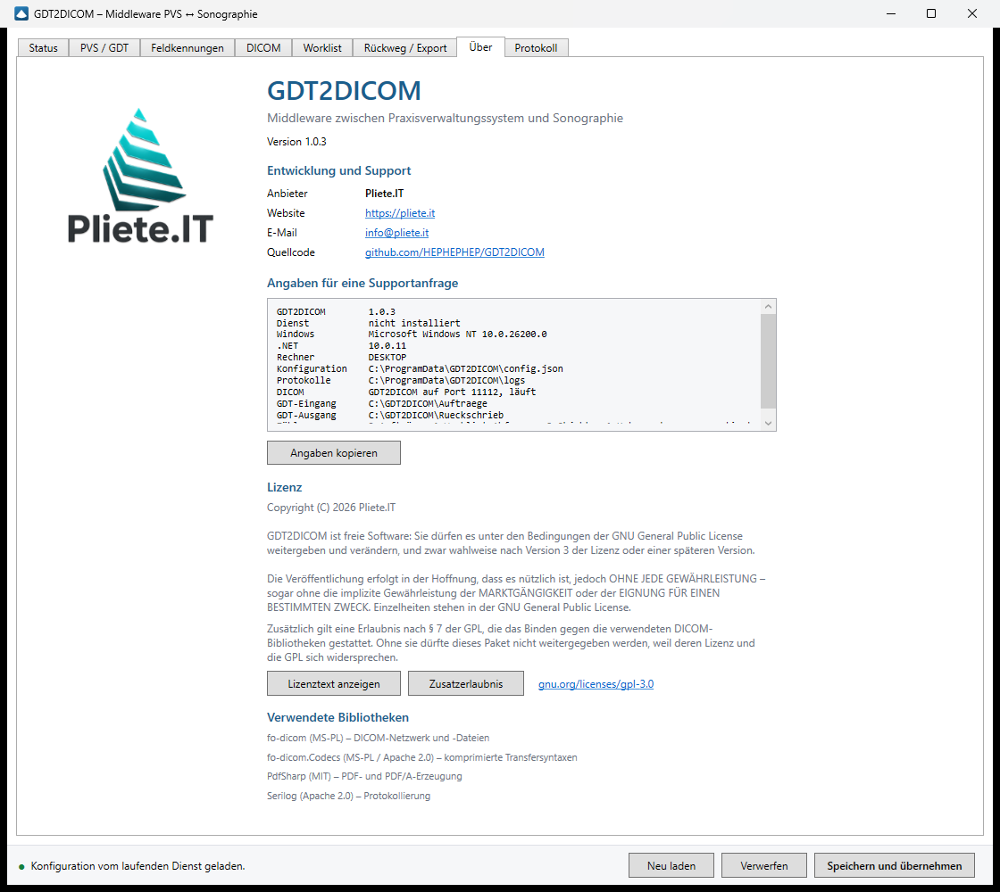

# GDT2DICOM

[](LICENSE)

Middleware zwischen einem Praxisverwaltungssystem (GDT) und einem Ultraschallgerät (DICOM) –
in beide Richtungen, als Windows-Dienst, vollständig über eine Oberfläche konfigurierbar.

```
   PVS                    GDT2DICOM (Windows-Dienst)                  Sonogerät
    │                                                                     │
    │  6302 Auftrag  ──►  GDT-Eingang überwachen                          │
    │   (Datei)           └─► Worklist-Eintrag  ◄── C-FIND (MWL) ─────────┤
    │                                                                     │
    │                                            ◄── N-CREATE/N-SET ──────┤  MPPS
    │                     Bilder + SR sammeln    ◄── C-STORE ─────────────┤
    │                     └─► JPEG, PDF, DICOM-Archiv                     │
    │                                            ──► N-EVENT-REPORT ─────►│  Commitment
    │  ◄── 6310 Rücksatz  GDT-Ausgang                                     │
    │      (Datei + Verweise auf PDF/JPEG)                                │
```

## Was die Middleware kann

**Richtung PVS → Gerät**

* Überwacht das GDT-Ausgabeverzeichnis des PVS (FileSystemWatcher **und** zyklisches Nachsehen,
  weil auf Netzlaufwerken regelmäßig Watcher-Ereignisse verloren gehen).
* Wandelt die Untersuchungsanforderung (Satzart 6302) in einen DICOM-Worklist-Eintrag um.
* Stellt eine **Modality Worklist** per C-FIND bereit, inklusive Wildcard-, Datums- und
  Zeitbereichs-Matching.

**Richtung Gerät → PVS**

* **Storage SCP** (C-STORE) nimmt Bilder, Cine-Loops und Structured Reports entgegen.
* **MPPS** (N-CREATE/N-SET) meldet Beginn und Ende der Untersuchung; „COMPLETED“ schließt die
  Untersuchung sofort ab, statt auf die Ruhezeit zu warten.
* **Storage Commitment** (N-ACTION) wird mit einem N-EVENT-REPORT über eine eigene Association
  an das Gerät beantwortet.
* Exportiert **JPEG/PNG**, baut ein **PDF-Befundblatt** mit Kopfdaten, Messwerten und Bildern,
  archiviert die **Original-DICOM-Dateien** und liest **DICOM Structured Reports** als
  Befundtext aus.
* Schreibt den **GDT-Rücksatz** (Satzart 6310) mit Befundzeilen und Dateiverweisen.

**Betrieb**

* Läuft als Windows-Dienst mit automatischem Neustart nach Fehlern.
* WPF-Oberfläche mit Live-Status, Worklist-Ansicht, Protokoll und Dienststeuerung.
* GDT 2.1 und GDT 3.0/3.1, Zeichensätze 7-Bit, CP437, ISO 8859-1 und UTF-8.
* Alle Feldkennungen sind einstellbar.

## Systemvoraussetzungen

* Windows 10/11 oder Windows Server 2019+ (x64)
* .NET 10 SDK zum Bauen. Für den Betrieb reicht das self-contained veröffentlichte Paket
  ohne installierte Runtime.

## Bauen und veröffentlichen

```powershell
dotnet build GDT2DICOM.slnx -c Release
```

```powershell
.\publish.ps1
```

Das Ergebnis liegt in `dist\`. Dienst und Oberfläche gehören in **denselben Ordner** – die
Oberfläche sucht `GDT2DICOM.Service.exe` daneben, um den Dienst zu installieren.

## Installation

### Mit dem Installationspaket

```powershell
.\installer\build-installer.ps1
```

Das erzeugt `installer\out\GDT2DICOM.msi` (rund 100 MB, alles enthalten — keine
.NET-Runtime nötig). Einmalig wird dafür WiX gebraucht:

```powershell
dotnet tool install --global wix --version 6.0.2
wix extension add -g WixToolset.UI.wixext WixToolset.Util.wixext WixToolset.Firewall.wixext
```

Auf dem Zielrechner:

| Aufruf | Wirkung |
|---|---|
| `msiexec /i GDT2DICOM.msi` | mit Oberfläche, Zielordner wählbar |
| `msiexec /i GDT2DICOM.msi /qn` | unbeaufsichtigt, für Rollouts |
| `msiexec /i GDT2DICOM.msi /qn FIREWALL=1 DICOMPORT=104` | zusätzlich Firewallregel anlegen |
| `msiexec /x GDT2DICOM.msi /qn` | entfernen |

Das Paket installiert nach `C:\Program Files\GDT2DICOM`, registriert den Dienst auf
automatischen Start samt Neustart nach einem Absturz, startet ihn und legt eine
Startmenü-Verknüpfung zur Konfiguration an. Eine neuere Fassung ersetzt die alte; der Dienst
wird dafür angehalten und danach wieder gestartet.

Zum Nachprüfen gibt es eine Abnahmeprüfung, die den vollständigen Lebenszyklus durchspielt —
installieren, Dienst und Steuerkanal prüfen, deinstallieren und nachweisen, dass die Daten
unter ProgramData erhalten geblieben sind. Sie braucht eine PowerShell mit
Administratorrechten:

```powershell
.\installer\verify-installer.ps1
.\installer\verify-installer.ps1 -Behalten   # am Ende installiert lassen
```

> **Die Deinstallation lässt `C:\ProgramData\GDT2DICOM` unangetastet.** Dort liegen
> Konfiguration, Protokolle, Worklist und das DICOM-Archiv — Behandlungsunterlagen, die eine
> Deinstallation nicht mitnehmen darf. Wer sie wirklich loswerden will, löscht den Ordner von
> Hand.

Die Firewallregel bleibt bewusst optional: Der DICOM-Port ist einstellbar, eine fest
verdrahtete Regel für 104 wäre bei abweichender Konfiguration wirkungslos.

### Ohne Installationspaket

1. Den Inhalt von `dist\` nach `C:\Program Files\GDT2DICOM` kopieren.
2. `GDT2DICOM.Konfiguration.exe` starten.
3. Reiter **Status** → **Installieren**. Windows fragt nach Administratorrechten; der Dienst
   wird angelegt, auf automatischen Start gesetzt und gestartet.

Deinstallation auf diesem Weg: Reiter **Status** → **Entfernen**.

### Danach

Auf den übrigen Reitern konfigurieren, dann **Speichern und übernehmen**. Läuft der Dienst,
übernimmt er die Änderungen sofort, ohne Neustart.

## Konfiguration

Alles steht in `C:\ProgramData\GDT2DICOM\config.json`. Die Datei wird beim ersten Start mit
Standardwerten angelegt; normalerweise bearbeitet man sie nicht von Hand.

Die Oberfläche hat acht Reiter. Die Aufnahmen unten zeigen einen laufenden Dienst mit
Testdaten – drei eingelesene Aufträge, einer davon schon exportiert.

### Reiter „Status“

Zustand des Dienstes, Zähler seit dem Start und die Untersuchungen, deren Bilder gerade
eintreffen. Von hier aus wird der Dienst installiert, gestartet und gestoppt; Windows fragt
dabei nach Administratorrechten. **Zugriff prüfen** testet die eingestellten Verzeichnisse
aus Sicht des Dienstkontos – bei Netzwerkfreigaben ist das der Unterschied, der zählt.



### Reiter „PVS / GDT“

| Einstellung | Bedeutung |
|---|---|
| Auftragseingang | Verzeichnis, in das das PVS die 6302-Datei schreibt |
| Rücksatz-Ausgang | Verzeichnis, aus dem das PVS die 6310-Datei liest |
| GDT-Version | 2.1 oder 3.0/3.1 – muss zum PVS passen |
| Zeichensatz | fast immer ISO 8859-1 (FK 9206 = 3) |
| GDT-ID Middleware / PVS | die Kennungen aus FK 8316 und 8315 |
| Gerätekennfeld | FK 8402, z. B. `SONO01` |

Die Schaltfläche **GDT-Testauftrag erzeugen** legt einen vollständigen Beispielauftrag im
Eingang ab – damit lässt sich die Kette bis zur Worklist ohne PVS prüfen.



#### Wenn das PVS ein Programm aufruft

Viele Praxisverwaltungssysteme legen die Auftragsdatei nicht nur ab, sondern starten
zusätzlich ein Fremdprogramm und lesen nach dessen Ende das Rücksatz-Verzeichnis. Dafür
liegt **`GDT2DICOM.Aufruf.exe`** bei. Die fertige Aufrufzeile steht im Reiter *PVS / GDT*
und lässt sich von dort in die Zwischenablage kopieren.

Das Programm nimmt den Dateipfad in jeder gebräuchlichen Form entgegen:

```
GDT2DICOM.Aufruf.exe C:\GDT\PVSSON.GDT
GDT2DICOM.Aufruf.exe "/GDT=C:\GDT\PVSSON.GDT"
GDT2DICOM.Aufruf.exe                          (neueste Datei im Eingangsverzeichnis)
```

Es meldet den Auftrag über den Steuerkanal an den Dienst, gibt dem Anwender bei Problemen
sofort eine Meldung und beendet sich in der Regel in unter einer Sekunde. Rückgabewerte:

| Wert | Bedeutung |
|---|---|
| 0 | Auftrag übernommen |
| 1 | Fehler, etwa unlesbare Datei oder nicht konfigurierte Satzart |
| 2 | Dienst nicht erreichbar – Auftrag wurde im Eingangsverzeichnis zwischengespeichert |
| 3 | Zeitlimit beim Warten auf den Rücksatz |
| 4 | vom Anwender abgebrochen |

#### Welche Betriebsart passt zu Ihrem PVS?

| Wie das PVS den Rücksatz einliest | Einstellung |
|---|---|
| Es überwacht das Importverzeichnis | *Rücksatz ausliefern* = **sofort**, Warten **aus**. Ein Aufruf bei der Anforderung, der Rücksatz erscheint später von selbst. |
| Nur beim Beenden des aufgerufenen Programms, ein Aufruf | Warten **ein**. Der Aufruf bleibt offen, bis die Bilder da sind — das PVS ist so lange blockiert. |
| Nur beim Beenden, zwei Geräteeinträge möglich | *Rücksatz ausliefern* = **auf Abruf**, Warten **aus**, zweiter Aufruf `--abholen` nach der Untersuchung. |

Alle drei Varianten sind gegen den laufenden Dienst durchgespielt.

#### Der zweite Aufruf: Bilder abholen

Die meisten PVS warten auf das Ende des aufgerufenen Programms und lesen erst dann das
Importverzeichnis. Bei einem Ultraschallgerät passt das nicht zum ersten Aufruf: Der legt nur
den Worklist-Eintrag an, die Bilder kommen Minuten später. Deshalb gibt es einen **zweiten
Aufruf**, den der Anwender nach der Untersuchung auslöst:

```
GDT2DICOM.Aufruf.exe --abholen C:\GDT\PVSSON.GDT   Rücksatz für den Patienten aus der Datei
GDT2DICOM.Aufruf.exe --abholen /patid=12345        mit direkter Patientennummer
GDT2DICOM.Aufruf.exe --abholen                     ältester wartender Rücksatz
```

Er legt keinen neuen Auftrag an, sondern stellt den bereitliegenden Rücksatz ins
Ausgangsverzeichnis und beendet sich — das PVS liest ihn dann beim Programmende ein. Liegt
noch nichts bereit, ist der Rückgabewert 5; das ist kein Fehler, sondern heißt „die
Untersuchung läuft noch".

Legen Sie im PVS zwei Geräteeinträge an: „Sono anfordern" und „Sono-Bilder abholen". Beide
Aufrufzeilen stehen im Reiter *PVS / GDT* zum Kopieren bereit.

Damit der Rücksatz bis dahin nicht schon im Ausgang liegt, stellen Sie **Rücksatz ausliefern**
auf *erst wenn das PVS ihn abholt*.

**Auf den Rücksatz warten** ist die Alternative zum zweiten Aufruf: Der erste Aufruf bleibt
offen, bis die Bilder da sind — mit einem Fenster „Untersuchung läuft" samt Abbruchknopf. Das
blockiert das PVS für die Dauer der Untersuchung und lohnt nur, wenn das Gerät im selben Raum
steht.

#### Fester Dateiname für den Rücksatz

Erwartet Ihr PVS einen festen Dateinamen wie `SONOPVS.GDT` statt des voreingestellten Musters
mit `{counter}`, dann würde eine zweite fertige Untersuchung den noch nicht abgeholten Befund
der ersten überschreiben. Dagegen gibt es **Neuen Rücksatz zurückhalten, solange der vorige
noch im Ausgang liegt** (standardmäßig aktiv): Der zweite Befund wartet dann im Rückstau und
rutscht automatisch nach, sobald das PVS die Datei abgeholt hat. Wie viele Rücksätze warten,
steht im Reiter *Status*.

Legt das PVS die Datei ins überwachte Eingangsverzeichnis *und* ruft das Programm auf, ist
der Auftrag beim Aufruf oft schon verarbeitet. Der Dienst erkennt das und meldet trotzdem
Erfolg — doppelte Worklist-Einträge entstehen dabei nicht.

Wer das sauber trennen will, schaltet **Eingangsverzeichnis laufend überwachen** ab. Dann
bleibt die Auftragsdatei liegen, bis der Aufruf kommt. Das ist die passende Einstellung,
wenn das PVS die Schnittstelle ausschließlich per Programmaufruf bedient.

Zum Ausprobieren gibt es im Reiter *PVS / GDT* die Schaltfläche **Testauftrag über den
Aufruf**: Sie erzeugt eine Auftragsdatei außerhalb des überwachten Verzeichnisses und
übergibt sie dem Connector — genau so, wie ein PVS es tut, ohne Wettrennen mit der
Überwachung.

Zum Prüfen der Einrichtung, ohne das PVS zu bemühen:

```powershell
.\GDT2DICOM.Aufruf.exe --diagnose
```

Das zeigt die angekommene Kommandozeile, die erkannte Datei samt Satzart und Patientendaten,
die eingestellten Verzeichnisse und ob der Dienst erreichbar ist. Aus einer Eingabeaufforderung
gestartet schreibt es in die Konsole, per Doppelklick in ein Fenster. Derselbe Aufruf steckt
in der Oberfläche hinter **Aufruf prüfen (Diagnose)**.

### Netzwerkpfade (UNC)

Alle Verzeichnisse dürfen UNC-Pfade sein, also `\\server\freigabe\gdt`. Für Auftragsein- und
-ausgang und für das DICOM-Archiv ist das der Normalfall, wenn PVS und Middleware auf
verschiedenen Rechnern laufen.

Drei Dinge müssen dabei stimmen:

**Der Dienst braucht ein Konto mit Zugriff.** Das ist der häufigste Stolperstein. GDT2DICOM
wird als *lokales Systemkonto* installiert, und dieses Konto hat im Netz überhaupt keine
Anmeldedaten — es meldet sich allenfalls als Computerkonto an. In einer Arbeitsgruppe ohne
Domäne kommt es an eine geschützte Freigabe grundsätzlich nicht heran. Stellen Sie den Dienst
dann in `services.msc` unter *Eigenschaften → Anmelden* auf ein Benutzerkonto um, das die
Freigabe erreicht.

> Bewusst gibt es dafür kein Eingabefeld in der Oberfläche: Ein Dienstkennwort müsste an
> `sc.exe` übergeben oder zwischengespeichert werden, und beides ist im Umgang mit Kennwörtern
> die schlechtere Lösung als der dafür vorgesehene Windows-Dialog.

**Zugeordnete Laufwerksbuchstaben funktionieren nicht.** Ein `Z:\`, das im Explorer sichtbar
ist, gilt nur für Ihre Anmeldesitzung. Der Dienst sieht es nicht, auch nicht unter demselben
Konto. Immer den vollen UNC-Pfad eintragen.

**Verzeichnisüberwachung über SMB ist unzuverlässig.** Windows liefert Änderungsmeldungen über
Netzwerkfreigaben nicht garantiert; manche NAS-Geräte melden gar nichts. Deshalb läuft
zusätzlich ein zyklisches Nachsehen (Reiter *PVS / GDT*, Vorgabe alle 10 Sekunden). Über
Netzwerk sollte dieser Wert nicht auf 0 stehen.

Im Reiter *Status* prüft **Zugriff prüfen** alle konfigurierten Verzeichnisse — und zwar
im Dienst, nicht in der Oberfläche. Das ist der Unterschied, auf den es ankommt: Die
Oberfläche läuft als angemeldeter Benutzer und erreicht die Freigabe meist problemlos, während
der Dienst daran scheitert. Die Prüfung legt in jedem Verzeichnis kurz eine Testdatei an und
löscht sie wieder, meldet das Konto des Dienstes und warnt, wenn Netzwerkpfade mit dem
Systemkonto kombiniert sind.

Das **Datenverzeichnis** (Worklist, Rückstau, Zähler) sollte lokal bleiben. Es wird häufig
geschrieben und braucht keine Freigabe.

### Reiter „Feldkennungen”

> **Wichtig:** Die Vorgaben folgen der verbreiteten Konvention, aber einzelne PVS belegen
> Feldkennungen abweichend. Maßgeblich ist immer die GDT-Dokumentation Ihres PVS-Herstellers.
> Prüfen Sie vor dem Produktivbetrieb besonders die Kennungen für **Dateianhänge**
> (Vorgabe: 6302 = Format, 6303 = Dateiverweis, 6304 = Beschreibung) sowie die
> **Befundzeile** (Vorgabe 6220). Ein falsch belegter Anhangsverweis ist der häufigste Grund
> dafür, dass Bilder im PVS nicht auftauchen.



### Reiter „DICOM“

Diese Werte müssen mit der Konfiguration am Sonogerät zusammenpassen:

| Am Gerät einzutragen | Wert aus GDT2DICOM |
|---|---|
| Worklist-Server AE-Titel | AE-Titel (Vorgabe `GDT2DICOM`) |
| Worklist-Server IP / Port | IP des Middleware-Rechners, Port (Vorgabe 104) |
| Storage-Ziel AE / IP / Port | dieselben Werte |
| Eigener AE-Titel des Geräts | unter „Gegenstellen“ eintragen |

Für **Storage Commitment** muss das Gerät unter „Gegenstellen“ mit AE-Titel, Host und Port
stehen: die Rückmeldung geht laut Standard über eine neue Verbindung zum Gerät, die Middleware
muss also wissen, wo sie es erreicht.

**Verbindung testen** schickt ein C-ECHO an die markierte Gegenstelle.



### Reiter „Worklist“

Oben die Vorgaben für neue Einträge: Modality, Institution, Auftragsnummer und die
UID-Wurzel. Für den Produktivbetrieb gehört dort eine eigene, registrierte OID hinein –
die Vorgabe ist eine allgemein gebräuchliche Wurzel und taugt nur zum Ausprobieren.

Darunter steht die aktuelle Worklist, die sich von selbst aktualisiert. Einträge lassen sich
mit Strg oder Umschalt mehrfach auswählen und löschen. Im Normalfall räumt sich die Liste
selbst auf: Ein Eintrag verschwindet, sobald das Gerät die Untersuchung per MPPS abschließt
oder die Bilder exportiert sind. In der Aufnahme sind deshalb nur noch zwei der drei
Aufträge zu sehen – der dritte ist bereits fertig.



### Reiter „Rückweg / Export“

Wann eine Untersuchung als abgeschlossen gilt, entscheidet die **Ruhezeit** (Vorgabe 60 s ohne
weiteres Bild) oder eine MPPS-Meldung „COMPLETED“. Erst danach werden Bilder, PDF und der
GDT-Rücksatz erzeugt – so landet eine Untersuchung als ein Vorgang im PVS und nicht als
zwanzig Einzelmeldungen.

#### Was gilt, wenn das Gerät MPPS meldet

Meldet das Gerät eine Untersuchung per MPPS als **laufend**, entscheidet es selbst über das
Ende: Die Ruhezeit greift dann nicht mehr, und auch eine Messpause von zehn Minuten zerreißt
die Untersuchung nicht. Abgeschlossen wird erst auf „COMPLETED" oder „DISCONTINUED".

Meldet das Gerät kein MPPS, bleibt die Ruhezeit die Rückfallebene. Deshalb ist sie ab Werk
eingeschaltet: Ob ein bestimmtes Gerät MPPS beherrscht, steht in dessen Conformance Statement
und lässt sich nicht voraussetzen. **`0` schaltet die Ruhezeit ab** – sinnvoll nur, wenn
feststeht, dass das Gerät MPPS meldet, sonst bleibt jede Untersuchung bis zur harten
Obergrenze (*Spätestens nach*, Vorgabe 30 Minuten) liegen.

Trifft die MPPS-Abschlussmeldung ein, **bevor** das erste Bild da ist – MPPS und Bilder laufen
über getrennte Verbindungen, die Reihenfolge ist nicht garantiert –, wird sie vorgemerkt und
greift, sobald die Untersuchung auftaucht.

`Dateiverweise als` steuert, ob im GDT-Satz der volle Pfad, ein relativer Pfad oder nur der
Dateiname steht. Welche Variante das PVS erwartet, steht in dessen GDT-Doku.

#### PDF/A für die elektronische Patientenakte

`Dateiformat` schaltet das Befundblatt zwischen normalem PDF und **PDF/A-3b** um. Die ePA
verlangt für Dokumente ein PDF/A-Format; PDF/A-3b bettet alle Schriften und ein sRGB-Farbprofil
ein, sodass die Datei auch in zwanzig Jahren noch gleich aussieht. Die Dateien werden dadurch
etwa 30 % größer.

Die erzeugten Dateien wurden mit **veraPDF 1.30** gegen das Profil PDF/A-3b geprüft – mit
Bildern als JPEG, mit Bildern als PNG und ohne Bilder, jeweils mit Umlauten im Befundtext.
Alle Varianten bestehen die Prüfung. Zum Nachprüfen im eigenen Haus:

```powershell
.\Testclient\GDT2DICOM.TestClient.exe musterbefund muster.pdf pdfa
```

Das erzeugt ein Befundblatt mit Beispieldaten, das sich anschließend durch einen
PDF/A-Validator schicken lässt.

> Ob ein konkretes Dokument von der ePA angenommen wird, hängt außer vom Dateiformat auch
> von Metadaten und der Einordnung nach KDL ab. Diese Middleware liefert die Datei; die
> Übergabe an die ePA übernimmt das PVS.

#### Begrenzung des DICOM-Archivs

`Archiv automatisch begrenzen` ist **standardmäßig aus**. Eingeschaltet entfernt die
Middleware Untersuchungen, die älter als die eingestellte Aufbewahrungsdauer sind, und –
wenn eine Maximalgröße gesetzt ist – zusätzlich die jeweils ältesten, bis das Archiv wieder
unter die Grenze passt. Beide Werte lassen sich mit 0 einzeln abschalten.

Gelöscht wird immer eine **vollständige Untersuchung**, nie einzelne Bilder daraus: eine
Studie, der die Hälfte der Aufnahmen fehlt, ist schlimmer als gar keine, weil der Verlust
beim Betrachten nicht auffällt. Dateien, die keine `.dcm`-Dateien sind, bleiben unangetastet.

> Die archivierten Untersuchungen sind Behandlungsunterlagen und unterliegen der ärztlichen
> Aufbewahrungspflicht. Schalten Sie die Begrenzung nur ein, wenn die Daten anderweitig
> gesichert sind — etwa weil das PVS die Bilder ohnehin übernimmt oder eine Datensicherung
> läuft.



### Reiter „Protokoll“

`Logs automatisch löschen` entfernt Logdateien, die älter als die eingestellte Aufbewahrungsdauer
sind (Vorgabe 30 Tage). Geprüft wird beim Dienststart und danach alle sechs Stunden. Betroffen
sind ausschließlich die eigenen Dateien nach dem Muster `gdt2dicom-*.log`; andere Dateien im
Logverzeichnis bleiben unangetastet.

Eine Aufbewahrung von 0 Tagen wird abgelehnt und im Protokoll vermerkt, statt das laufende
Protokoll mitzulöschen. Wer nichts automatisch löschen lassen will, nimmt das Häkchen heraus.

Für das DICOM-Archiv gibt es eine eigene, standardmäßig ausgeschaltete Begrenzung im Reiter
*Rückweg / Export*. Das Archiv verarbeiteter GDT-Aufträge wächst dagegen weiter; es ist
klein (Textdateien) und dient der Nachvollziehbarkeit.

Die Anzeige läuft mit, solange `automatisch mitlaufen` gesetzt ist. Für die Fehlersuche
lohnt der Umfang **Debug** – dann steht jede DICOM-Assoziation mit ausgehandelten
Presentation Contexts im Protokoll, wie in der Aufnahme zu sehen.



### Reiter „Über“

Version, Kontaktwege und die Angaben, die bei einer Supportanfrage regelmäßig gebraucht
werden – Dienstzustand, Windows- und .NET-Version, die verwendeten Verzeichnisse und die
Zähler. **Angaben kopieren** legt sie als Text in die Zwischenablage, das erspart die übliche
Rückfragerunde. Darunter stehen Lizenz und Zusatzerlaubnis, beide direkt aus dem
Installationsverzeichnis heraus zu öffnen.



## Testen ohne Sonogerät

Im Ordner `Testclient` liegt ein Werkzeug, das die Rolle des Geräts übernimmt:

```powershell
.\GDT2DICOM.TestClient.exe echo 127.0.0.1 104 SONO GDT2DICOM
.\GDT2DICOM.TestClient.exe worklist 127.0.0.1 104 SONO GDT2DICOM US
.\GDT2DICOM.TestClient.exe makedicom bild1.dcm TEST0815 Mustermann Erika <StudyUID> <Accession>
.\GDT2DICOM.TestClient.exe makesr report.dcm TEST0815 Mustermann Erika <StudyUID> <Accession>
.\GDT2DICOM.TestClient.exe store 127.0.0.1 104 SONO GDT2DICOM bild1.dcm report.dcm
.\GDT2DICOM.TestClient.exe mpps 127.0.0.1 104 SONO GDT2DICOM <StudyUID> <Accession> TEST0815
.\GDT2DICOM.TestClient.exe commit 127.0.0.1 104 SONO GDT2DICOM 11113 bild1.dcm
.\GDT2DICOM.TestClient.exe musterbefund muster.pdf pdfa bild.jpg
```

Typischer Ablauf: Testauftrag in der Oberfläche erzeugen → `worklist` abfragen und Study UID
sowie Accession Number notieren → damit `makedicom`/`makesr` aufrufen → `store` → im
Ausgangsverzeichnis liegt kurz darauf der GDT-Rücksatz.

## Verzeichnisse

| Pfad | Inhalt |
|---|---|
| `C:\ProgramData\GDT2DICOM\config.json` | Konfiguration |
| `C:\ProgramData\GDT2DICOM\logs` | Tagesrotierende Logdateien |
| `C:\ProgramData\GDT2DICOM\data` | Worklist-Speicher, Zähler, GDT-Archiv |
| `C:\ProgramData\GDT2DICOM\data\incoming` | frisch empfangene DICOM-Objekte |
| `C:\ProgramData\GDT2DICOM\data\dicom` | DICOM-Archiv, nach Patient und Untersuchung sortiert |

## Fehlersuche

**Das Gerät findet keine Worklist-Einträge.**
Reiter *Worklist* prüfen: Steht der Auftrag dort? Wenn nein, liegt es an der GDT-Seite – Reiter
*Protokoll* auf „Debug“ stellen und den Dienst neu starten. Wenn ja, fragt das Gerät vermutlich
mit einem Scheduled Station AE Title, der nicht zur Konfiguration passt; das Feld unter
*Worklist* leer lassen deaktiviert diese Prüfung.

**Der DICOM-Server startet nicht.**
Im Reiter *Status* steht der Grund. Meist ist Port 104 belegt (anderer DICOM-Dienst) oder die
Windows-Firewall blockiert eingehende Verbindungen. Für den Port eine eingehende Regel anlegen:

```powershell
New-NetFirewallRule -DisplayName "GDT2DICOM DICOM" -Direction Inbound -Protocol TCP -LocalPort 104 -Action Allow
```

**Bilder kommen an, aber das PVS zeigt nichts.**
Fast immer die Feldkennungen der Anhänge (siehe oben) oder die Einstellung
`Dateiverweise als`. Den erzeugten Rücksatz im Ausgangsverzeichnis mit einer vom PVS-Hersteller
gelieferten Beispieldatei vergleichen.

**Der Dienst läuft, die Oberfläche zeigt „keine Verbindung“.**
Die Oberfläche spricht über die Named Pipe `\\.\pipe\GDT2DICOM.Control` mit dem Dienst. Ohne
Verbindung arbeitet sie weiter direkt auf der Konfigurationsdatei; Änderungen greifen dann erst
beim nächsten Dienststart.

## Projektstruktur

```
src/GDT2DICOM.Core/          Konfiguration, GDT, DICOM, Pipeline, Export, IPC
src/GDT2DICOM.Service/       Windows-Dienst (Worker Host)
src/GDT2DICOM.Gui/           WPF-Konfigurationsoberfläche
src/GDT2DICOM.Connector/     Fremdprogramm für PVS, die die Schnittstelle per Aufruf bedienen
tools/GDT2DICOM.TestClient/  Geräte-Simulator für Inbetriebnahme und Fehlersuche
installer/                   WiX-Paketdefinition und Bauskript für GDT2DICOM.msi
assets/                      Programmsymbol und Logo-Aufbereitung, jeweils mit Generator
docs/screenshots/            Bildschirmfotos der Oberfläche, in diesem README eingebunden
```

## Programmsymbol

`assets/gdt2dicom.ico` enthält die Größen 16 bis 256 Pixel und ist in alle drei Programme
eingebunden. Das Symbol wird nicht in einem Grafikprogramm gepflegt, sondern von
`assets/generate-icon.ps1` gezeichnet – so lassen sich Farben und Formen nachvollziehbar
ändern, ohne dass jemand die Quelldatei suchen muss:

```powershell
.\assets\generate-icon.ps1
```

Das Skript schreibt neben der Icon-Datei eine Vorschau aller Größen nebeneinander
(`gdt2dicom-preview.png`). Größen unter 24 Pixeln bekommen bewusst ein vereinfachtes Motiv
ohne Schallkopf und Doppelpfeil, weil diese Details dort nicht mehr auflösen.

## Logo

Der Reiter *Über* zeigt das Logo von Pliete.IT, die Verweise auf Website, E-Mail und
Quellcode sowie einen Block mit Angaben für eine Supportanfrage (Version, Dienstzustand,
Verzeichnisse, Zähler) samt Kopieren-Schaltfläche.

Die eingebettete Fassung entsteht aus `logo.png` im Projektstamm:

```powershell
.\assets\prepare-logo.ps1
```

Das Skript verkleinert die Vorlage und stellt den nahezu weißen Hintergrund frei — sonst
zeichnet er sich auf der hellen Oberfläche als blasser Kasten ab. Freigestellt wird nur, was
unbunt und sehr hell ist; farbige Flächen und der dunkle Schriftzug bleiben unberührt, weiche
Kanten bekommen einen gleitenden Übergang.

## Verwendete Bibliotheken

| Paket | Zweck | Lizenz |
|---|---|---|
| fo-dicom | DICOM-Netzwerk und -Dateien | MS-PL |
| fo-dicom.Codecs | komprimierte Transfersyntaxen | MS-PL / Apache 2.0 |
| PdfSharp | PDF-Befundblatt | MIT |
| Serilog | Protokollierung | Apache 2.0 |

Vollständige Aufstellung mit Versionen: [THIRD-PARTY-NOTICES.md](THIRD-PARTY-NOTICES.md).

## Lizenz

Copyright (C) 2026 Pliete.IT

GDT2DICOM ist freie Software: Sie dürfen es unter den Bedingungen der GNU General Public
License weitergeben und verändern, und zwar wahlweise nach Version 3 der Lizenz oder einer
späteren Version.

Die Veröffentlichung erfolgt in der Hoffnung, dass es nützlich ist, jedoch OHNE JEDE
GEWÄHRLEISTUNG – sogar ohne die implizite Gewährleistung der MARKTGÄNGIGKEIT oder der
EIGNUNG FÜR EINEN BESTIMMTEN ZWECK. Einzelheiten stehen in der GNU General Public License.

Der vollständige Lizenztext liegt in [LICENSE](LICENSE) und im Installationsverzeichnis als
`LICENSE.txt`; in der Oberfläche führt der Reiter **Über** darauf. Andernfalls:
<https://www.gnu.org/licenses/>.

Was das praktisch heißt: Wer eine veränderte Fassung an Dritte weitergibt, muss den
Quellcode dieser Fassung unter denselben Bedingungen mitliefern. Für den Einsatz in der
eigenen Einrichtung – auch verändert – entsteht keine solche Pflicht.

### Zusätzliche Erlaubnis nach GPL § 7

Die verwendeten DICOM-Bibliotheken stehen unter der Microsoft Public License, die die FSF
als nicht GPL-verträglich einstuft. Damit übersetzte Pakete – insbesondere das MSI –
überhaupt weitergegeben werden dürfen, erlaubt der Rechteinhaber das Binden gegen diese
Bibliotheken ausdrücklich. Wortlaut und Reichweite:
[LICENSE-EXCEPTION.md](LICENSE-EXCEPTION.md), im Installationsverzeichnis als
`LICENSE-EXCEPTION.txt`.

Die Pflicht, bei Weitergabe eines übersetzten Pakets den Quellcode mitzuliefern, bleibt
davon unberührt.

## Hinweis zum regulatorischen Rahmen

Software, die Patienten- und Befunddaten zwischen medizinischen Systemen überträgt, kann je
nach Zweckbestimmung und beworbener Funktion als Medizinprodukt im Sinne der MDR gelten. Diese
Bewertung hängt am konkreten Einsatz und ist vor einem Vertrieb an Dritte zu klären. Für den
Eigengebrauch in der eigenen Einrichtung gelten andere Regeln als für ein in Verkehr gebrachtes
Produkt.

Unabhängig davon: Vor dem Produktivbetrieb die komplette Kette mit Testpatienten durchspielen
und prüfen, ob Patientenzuordnung, Geburtsdatum und Untersuchungsdatum im PVS korrekt ankommen.
